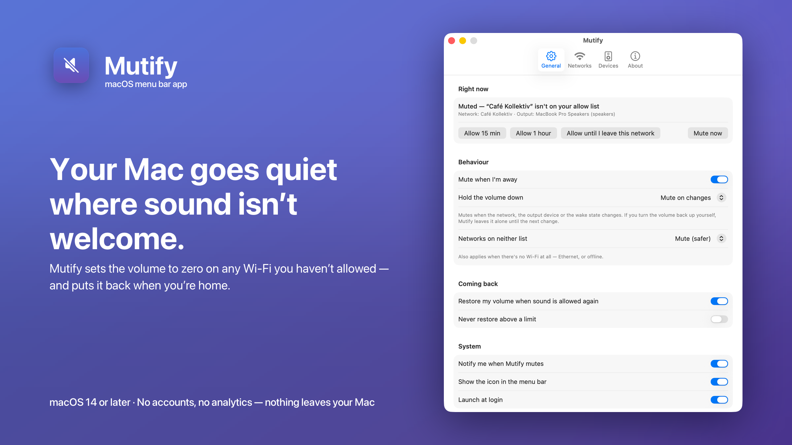
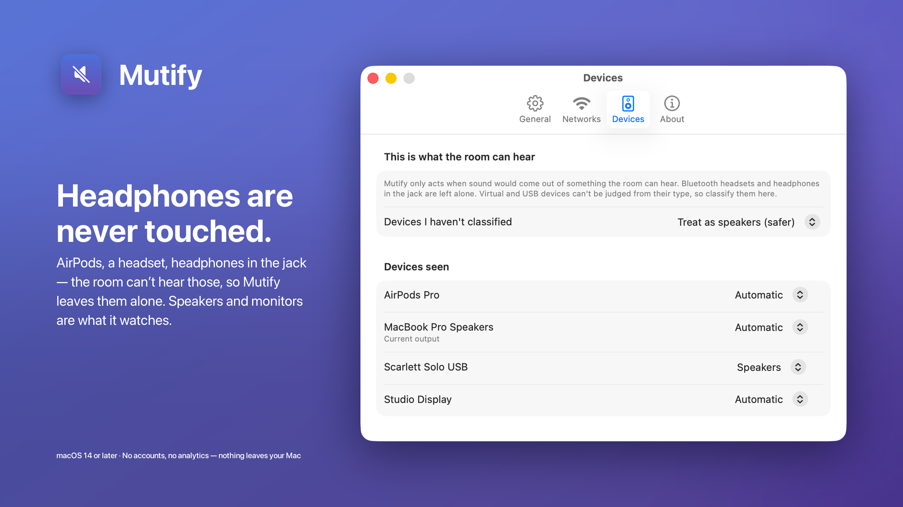
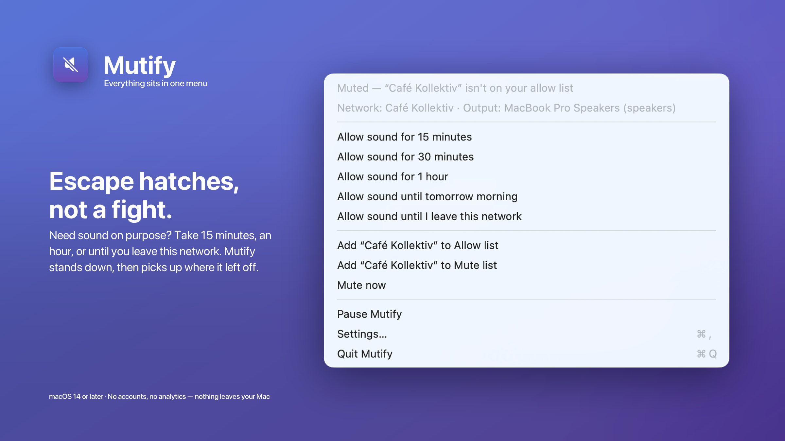
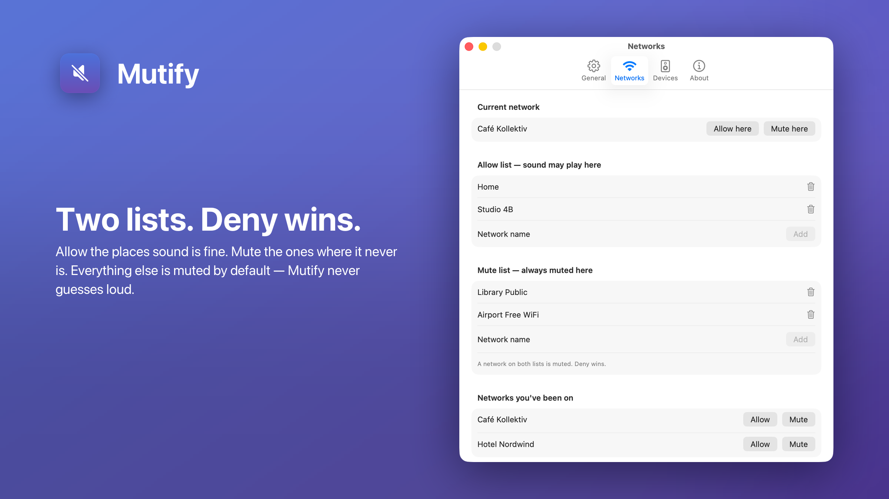

# Mutify

A macOS menu bar app that sets the output volume to **0** whenever you're
somewhere sound isn't welcome and the sound would come out of speakers the room
can hear. Headphones are never touched. See [PRD.md](PRD.md) for the reasoning
behind every rule.



## Download

[**Mutify 1.0**](https://github.com/Schmedu/mutify/releases/latest) — a signed,
notarized DMG for Apple Silicon, macOS 14 or newer. Drag it to Applications; it
opens without a Gatekeeper detour. No installer and no updater: a new version is
a new download.

## How it decides

```
mute  ⟺  set up and not paused
         AND no override running
         AND the output device is room-audible
         AND the Wi-Fi network isn't on the allow list
```

| Situation | Result |
|---|---|
| Network on the **mute list** | muted (deny wins over the allow list) |
| Network on the **allow list** | sound allowed |
| Network on neither, or no network at all | your "unknown networks" setting — muted by default |
| Nothing identifies the network | stands down, with a warning — never mutes on a guess |
| AirPods, headset, headphones in the jack | left alone, wherever you are |
| Built-in speakers, a monitor over HDMI | treated as room-audible |
| Virtual/USB devices | classified by you on the **Devices** tab |



**Temporary escape hatches:** allow sound for 15/30 minutes, an hour, until
tomorrow morning, or until you leave this network — plus an indefinite pause.
A volume Mutify lowered is put back when sound is allowed again, on the device it
lowered it on, and only if you haven't changed it yourself in the meantime.



## Build and install

```sh
./Scripts/build.sh            # builds build/Mutify.app
./Scripts/build.sh --install  # …and moves it to /Applications and launches it
./Scripts/build.sh --release  # …signed, notarized and stapled: a DMG others can run
swift test                    # the decision engine's test suite
```

Everyday builds sign with a Developer ID certificate if you have one, otherwise
a development certificate, otherwise ad-hoc. The last two run only on the Mac
that built them — Gatekeeper refuses them everywhere else, which is what
`--release` exists to avoid.

`--release` needs two things, and checks for both before it compiles anything:

- a **Developer ID Application** certificate (paid Apple Developer Program:
  Xcode ▸ Settings ▸ Accounts ▸ Manage Certificates ▸ + );
- notary credentials in the keychain, stored once with

  ```sh
  xcrun notarytool store-credentials mutify-notary \
    --apple-id <apple id> --team-id <team id> --password <app-specific password>
  ```

  (`MUTIFY_NOTARY_PROFILE=<name>` to use a different profile.) A shell that
  can't write to the login keychain — any non-interactive one — can pass the
  same credentials per run instead, which are never stored:

  ```sh
  MUTIFY_APPLE_ID=<apple id> MUTIFY_NOTARY_PASSWORD=<app-specific password> \
    ./Scripts/build.sh --release
  ```

It then signs with the hardened runtime and a secure timestamp, notarizes the
app, staples the ticket into the app *and* into the disk image — so a Mac that
is offline on first launch still gets a verdict — and leaves
`build/Mutify-<version>.dmg` and a matching `.zip` behind, each checked with
`spctl` the way another Mac will check them. `VERSION=1.1 ./Scripts/build.sh
--release` sets the marketing version; the build number is the commit count.

The binary is arm64 only, so it needs an Apple Silicon Mac, and macOS 14 or
newer.

Posting the result:

```sh
gh release upload v1.0 build/Mutify-1.0.dmg build/Mutify-1.0.zip
gh release edit v1.0 --draft=false
```

## If the menu bar icon doesn't appear

macOS parks new menu bar items to the left of the notch when the bar is full, in
a region it never draws — the item exists, it just can't be seen. This is a
system limitation, not an app bug, and it affects any newly launched menu bar
app on a crowded Mac.

**Opening Mutify again (double-click it in Finder, or `open -a Mutify`) always
brings up its window**, and every control from the menu is also in that window,
so the app stays fully usable either way. To get the icon back, quit a menu bar
app or install a menu bar manager such as Ice.

The icon can also be turned off on purpose — *General ▸ Show the icon in the
menu bar*. Mutify keeps muting without it; opening the app again is then the way
back to its window.

## How Mutify tells networks apart

The obvious answer is the Wi-Fi name, and macOS won't give it up. Since macOS 14
an app without Location Services access doesn't get an error when it asks — it
gets the literal string `<redacted>`, from CoreWLAN, from `ipconfig getsummary`
and from `system_profiler` alike. Treating that as a network name would be
worse than useless: allow-listing it would allow-list every network whose name
can't be read.

So Mutify identifies a network by **its router's hardware address**, which needs
no permission at all and is the better identifier anyway — two cafés both called
"FRITZ!Box" are two different networks, and this tells them apart. Networks
identified this way show up as *"Unnamed network (router …2b:3c)"*, and you can
give them a name of your own on the Networks tab.



Granting Location access is still worth it: the real Wi-Fi name then appears
instead. A network is matched by **either** identifier, so entries added before
the grant keep working after it.

Nothing about your location or your networks ever leaves the machine.

## Diagnostics

```sh
/Applications/Mutify.app/Contents/MacOS/Mutify --probe
```
prints the network, every output device with its classification, and the decision
Mutify would make right now.

```sh
… --probe-as "MacBook Pro Speakers"   # what happens when my AirPods die?
… --ask-location                       # trigger the Location permission prompt
… --probe-write "MacBook Pro Speakers" # can this device be muted and restored?
MUTIFY_DEBUG_STATUS=1 …                # where the menu bar icon was placed
```

`--probe-write` briefly silences the named device and puts it back; it warns
first if that device is the current output.

## Where things live

| | |
|---|---|
| Settings | `~/Library/Application Support/Mutify/settings.json` |
| Runtime state (override, remembered volumes) | `…/Mutify/state.json` |
| Activity log | `~/Library/Logs/Mutify/mutify.log` |

## Layout

- `Sources/MutifyCore` — the decision engine. Pure functions, no I/O, no frameworks.
- `Sources/Mutify` — CoreAudio, CoreWLAN, CoreLocation, the menu and the window.
- `Tests/MutifyCoreTests` — one test per rule and per scenario in the PRD.

## Licence

MIT — see [LICENSE](LICENSE).
